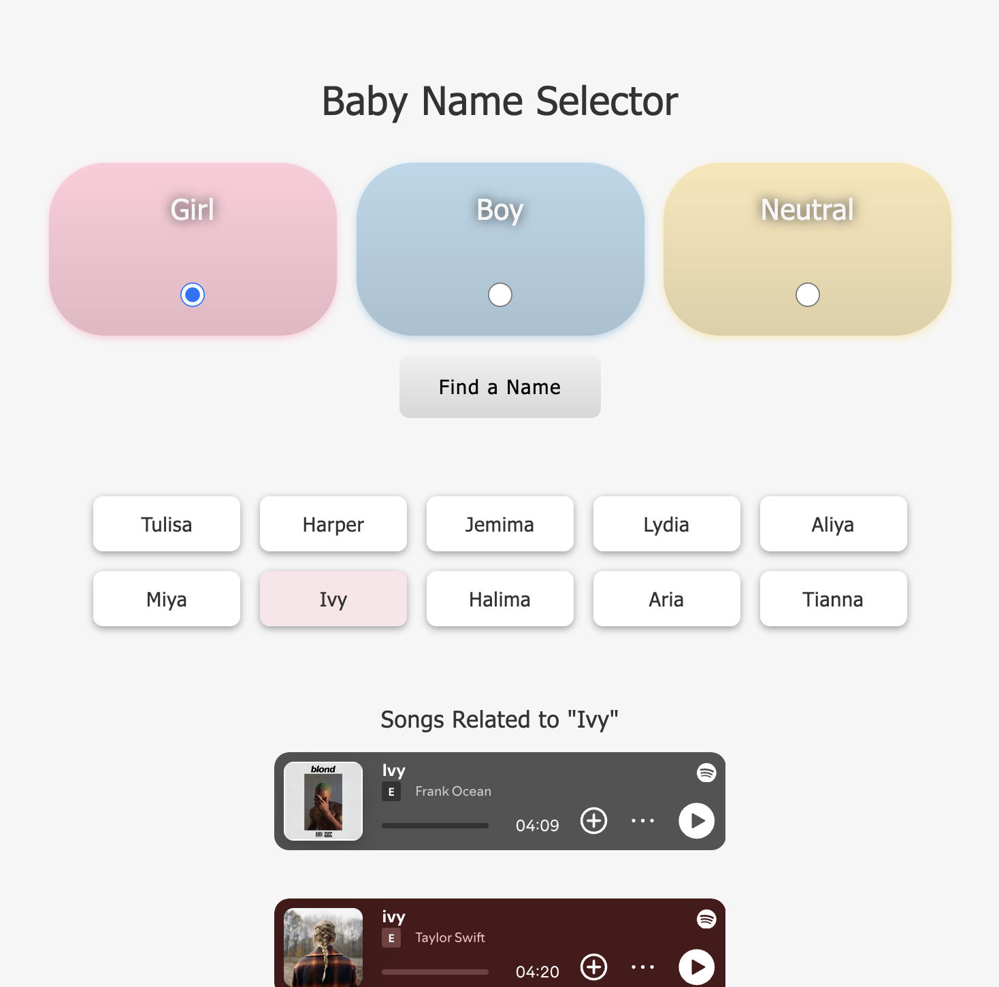

# Baby Name Selector App

> Get inspired to choose the perfect baby name by checking out related songs.

> 

## Table of Contents

1. [Tech Stack](#tech-stack)
1. [Development](#development)
   1. [Baby Names API](#baby-names-api)
   1. [Spotify API](#spotify-api)
   1. [Notes](#notes)

## Tech Stack

- **HTML**
- **CSS**
- **JavaScript**

## Development

### Baby Names API

- Obtain a free API key from API Ninjas at: https://api-ninjas.com/.
- Update the `API_NINJA_KEY` value with your key on line 1 of main.js.

### Spotify API

- Obtain your free `CLIENT_ID` and `CLIENT_SECRET` from Spotify at: https://developer.spotify.com/documentation/web-api.
- In the terminal, run the following command to get a temporary access token, replacing `CLIENT_ID` and `CLIENT_SECRET` accordingly (tokens expire in one hour). See https://developer.spotify.com/documentation/web-api/tutorials/client-credentials-flow for more information.

  `curl -X POST "https://accounts.spotify.com/api/token" \
-H "Content-Type: application/x-www-form-urlencoded" \
-d "grant_type=client_credentials&client_id=CLIENT_ID&client_secret=CLIENT_SECRET"`

- Update the `SPOTIFY_TOKEN` value with your generated token on line 2 of main.js.
- Open the app in your browser, select a gender, pick a name and get inspired!

### Notes

Visit the official API Ninjas' Baby Names documentation at https://api-ninjas.com/api/babynames and the Spotify documentation at https://developer.spotify.com/documentation/web-api/ for more information on API use, copyright, and rate limitations.
